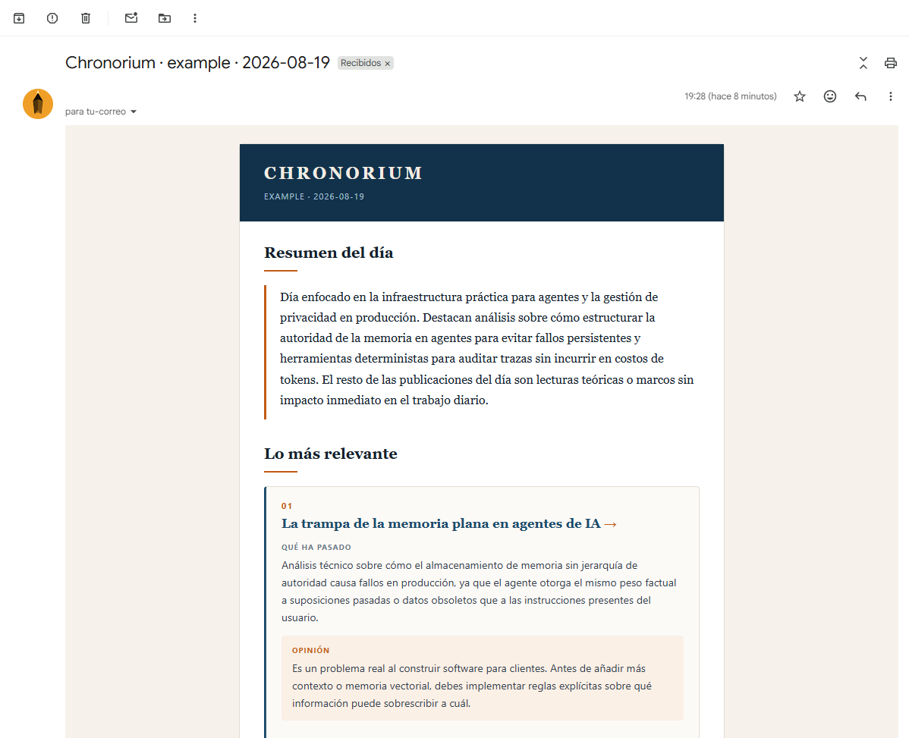

# Chronorium

**Para quién es esto:** para cualquiera con cuenta de GitHub que quiera un informe periódico sobre
un tema que sigue. Nada de lo de abajo exige escribir código.

Chronorium convierte lo que quieras seguir en un informe periódico con opinión propia, y con qué
puedes aplicarte de ello. El motor no sabe nada de noticias ni de IA: tu tema, tus fuentes, el
tono y la estructura del informe viven en una _receta_ (una carpeta de YAML y Markdown que tú
editas), nunca en el código. Apúntalo a biotecnología, a novedades legales, a tu propio stack, y se
comporta igual.

## Un informe real, de principio a fin

Esta es la salida real de `recipes/example`, generada de verdad (modelo real, fuentes vivas), sin
retocar a mano.



El texto completo (por si la imagen no carga) está en [docs/informe-ejemplo.md](docs/informe-ejemplo.md).

## Monta tu propia instancia

Esto es lo que quiere casi todo el mundo de verdad: tu propio tema, con tu propia cadencia,
entregado donde lo revisas. Dos pasos, sin código:

1. **Escribe tu receta**: tres ficheros de texto que deciden de qué habla tu informe: temas,
   fuentes, tono. Ver [Escribe tu propia receta](docs/07-escribir-una-receta.md); incluye un prompt
   que puedes pasarle a una IA si prefieres no escribirla a mano.
2. **Crea tu instancia**: un repositorio pequeño con tu receta y un `briefing.yml` que le dice a
   GitHub Actions cuándo ejecutarla. Ver [Monta tu propia instancia](docs/arranque.md).

No hace falta forkear este repositorio para ninguno de los dos pasos. Tu repositorio de instancia
se queda pequeño (tu receta, más el archivo que se va llenando solo): llama a este motor
directamente, fijado a una versión publicada, igual que cualquier acción de GitHub llama a un
workflow reutilizable.

## Pruébalo primero, en cinco minutos

¿Quieres verlo funcionar antes de escribir tu propia receta? Haz fork de este repositorio y
ejecuta el ejemplo incluido en local. Una sola cosa que dar de alta: una clave de API gratuita de
Google AI Studio para el modelo que redacta tu informe. Nada más necesita cuenta, y ninguna fuente
de la receta de ejemplo exige una credencial propia.

1. **Haz fork de este repositorio** y clona tu fork:

   ```bash
   git clone https://github.com/<your-username>/chronorium.git
   cd chronorium
   ```

2. **Instala las dependencias.** Este proyecto usa [pnpm](https://pnpm.io)(ejecuta `npm install -g pnpm` para instalarlo si no lo tienes);
   ejecutar `npm install` aquí se salta el fichero de bloqueo del que depende el proyecto.

   ```bash
   pnpm install
   ```

   Verás a pnpm resolver y enlazar los paquetes que lista `package.json`. Sin más salida que esa,
   ha funcionado.

3. **Configura la clave del modelo.** Consigue una clave gratuita de
   [Google AI Studio](https://aistudio.google.com/apikey) y expórtala en tu terminal:

   ```bash
   export GOOGLE_GENERATIVE_AI_API_KEY="your-key-here"
   ```

4. **Ejecuta la receta de ejemplo:**

   ```bash
   pnpm cli run --recipe example
   ```

   Esto recoge datos de <!-- check-docs:example-source-count -->`4`<!-- /check-docs:example-source-count -->
   fuentes públicas vivas, los puntúa y deduplica, se los pasa al
   modelo, y escribe el informe en `data/archive/`. Verás un resumen de una línea con lo
   recolectado y dónde quedó el informe. Si una fuente está caída o limitada por tasa, la ejecución
   sigue adelante y lo dice: no falla el informe entero por un canal quisquilloso.

Y ya está: sin servidor, nada que desplegar, ninguna cuenta más allá de la del proveedor de modelo.

## Qué hay que saber antes de fiarte

Chronorium existe porque una versión anterior de esta misma idea se rompió en silencio, de cinco
formas concretas y medidas, a lo largo de 49 días de ejecución sin supervisión. Nada de esto es
hipotético:

- **Una cadena de respaldo con un solo eslabón vivo aparenta redundancia, y no lo es.** Una única
  credencial funcionando detrás de dos proveedores configurados costó seis días de informes
  perdidos antes de que nadie lo notara. Chronorium lo comprueba al arrancar y lo dice en voz alta
  si solo tienes un proveedor configurado.
- **Un aviso por evento no comunica una condición crónica.** Se enviaron cinco avisos mientras se
  perdían once días de informes, porque cada aviso solo decía "hoy ha fallado", nunca "llevas
  nueve días así". El estado de salud de Chronorium viaja dentro del propio informe, no solo como
  un aviso suelto.
- **Un marcador de posición guardado como credencial no falla al guardarse, falla cada mañana.**
  La validación de Chronorium rechaza el valor de marcador documentado sin más, antes de que
  ninguna ejecución dependa de él.
- **Una regla escrita en el prompt del modelo es una preferencia, no una garantía.** Todo lo que
  tiene que cumplirse siempre, como "nunca inventes un enlace que no estuviera en la entrada", se
  impone en código que comprueba la salida del modelo, no se le pide al modelo con la esperanza de
  que la respete.
- **La documentación se desincroniza del código en semanas si nada la comprueba.** `pnpm run
check:docs` corre en CI y rompe la construcción si un valor por defecto, una variable de entorno
  o un número de fuentes documentado deja de coincidir con la realidad.

## Para saber más

- **[Escribe tu propia receta](docs/07-escribir-una-receta.md)**: la guía que necesita casi
  todo el mundo. Sin código, solo editar ficheros de texto. Incluye un prompt para pegar en tu IA si
  prefieres que te lo monte ella.
- **[Monta tu propia instancia](docs/arranque.md)**: convierte tu receta en algo que se ejecuta
  solo cada mañana: cron, secretos, comprobación final. También tiene su propio prompt.
- **[Extiende el motor](docs/08-extender-el-motor.md)**: añadir un tipo de fuente o un canal de
  entrega, para quien programe en TypeScript.
- **[Glosario](docs/glosario.md)**: cada término usado arriba, una frase por entrada.
- **[Documentación completa](docs/README.md)**: la arquitectura, el modelo de datos y las
  decisiones de diseño detrás de por qué el proyecto es como es.
- **[Licencia](LICENSE)** (MIT) · **[Cómo contribuir](CONTRIBUTING.md)** · **[Política de seguridad](SECURITY.md)**

Prefer English? See [README.md](README.md).
